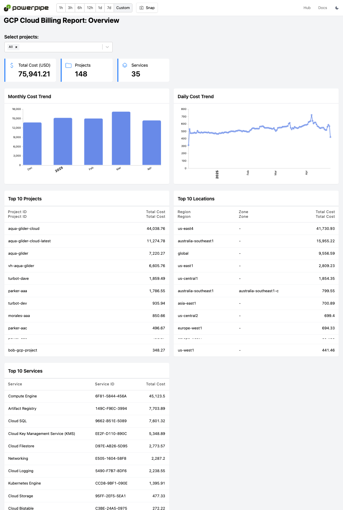
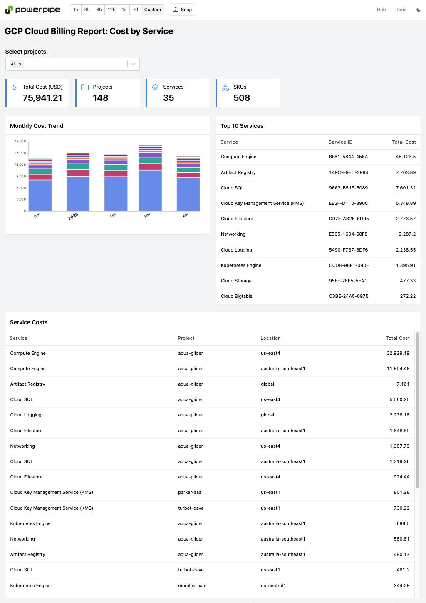

# GCP Cloud Billing Insights Mod for Powerpipe

[Tailpipe](https://tailpipe.io) is an open-source CLI tool that allows you to collect logs and query them with SQL.

[GCP](https://cloud.google.com/) is a suite of cloud computing services that runs on the same infrastructure that Google uses internally for its end-user products.

The [GCP Cloud Billing Insights Mod](https://hub.powerpipe.io/mods/turbot/tailpipe-mod-gcp-cloud-billing-insights) contains pre-built dashboards which can be used to monitor and analyze costs across your GCP projects using [Cloud Billing Reports](https://cloud.google.com/billing/docs/reports).

View insights in dashboards:



## Documentation

- **[Dashboards →](https://hub.powerpipe.io/mods/turbot/tailpipe-mod-gcp-cloud-billing-insights/dashboards)**

## Getting Started

Install Powerpipe from the [downloads](https://powerpipe.io/downloads) page:

```sh
# MacOS
brew install turbot/tap/powerpipe
```

```sh
# Linux or Windows (WSL)
sudo /bin/sh -c "$(curl -fsSL https://powerpipe.io/install/powerpipe.sh)"
```

This mod requires GCP Cloud Billing Reports to be collected using [Tailpipe](https://tailpipe.io) with the [GCP plugin](https://hub.tailpipe.io/plugins/turbot/gcp):

- [Get started with the GCP plugin for Tailpipe →](https://hub.tailpipe.io/plugins/turbot/gcp#getting-started)

Install the mod:

```sh
mkdir dashboards
cd dashboards
powerpipe mod install github.com/turbot/tailpipe-mod-gcp-cloud-billing-insights
```

### Browsing Dashboards

Start the dashboard server:

```sh
powerpipe server
```

Browse and view your dashboards at **http://localhost:9033**.

## Open Source & Contributing

This repository is published under the [Apache 2.0 license](https://www.apache.org/licenses/LICENSE-2.0). Please see our [code of conduct](https://github.com/turbot/.github/blob/main/CODE_OF_CONDUCT.md). We look forward to collaborating with you!

[Tailpipe](https://tailpipe.io) and [Powerpipe](https://powerpipe.io) are products produced from this open source software, exclusively by [Turbot HQ, Inc](https://turbot.com). They are distributed under our commercial terms. Others are allowed to make their own distribution of the software, but cannot use any of the Turbot trademarks, cloud services, etc. You can learn more in our [Open Source FAQ](https://turbot.com/open-source).

## Get Involved

**[Join #tailpipe and #powerpipe on Slack →](https://turbot.com/community/join)**

Want to help but don't know where to start? Pick up one of the `help wanted` issues:

- [Powerpipe](https://github.com/turbot/powerpipe/labels/help%20wanted)
- [Tailpipe](https://github.com/turbot/tailpipe/labels/help%20wanted)
- [GCP Cloud Billing Insights Mod](https://github.com/turbot/tailpipe-mod-gcp-cloud-billing-insights/labels/help%20wanted)
